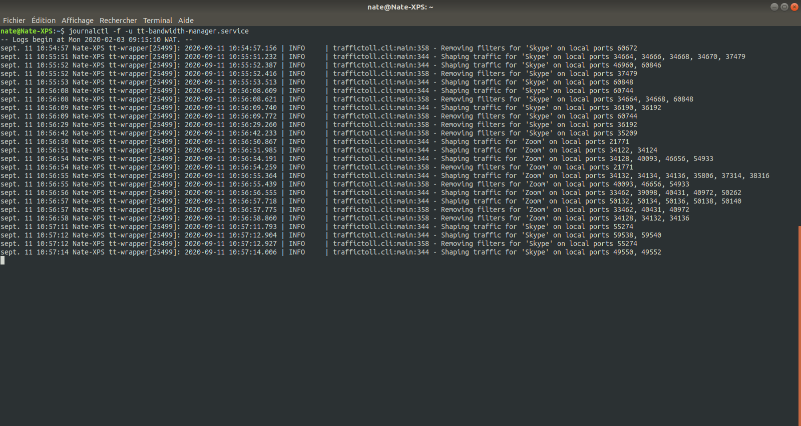

# tt-bandwidth-manager
Manage bandwidth usage via a systemd service by:
- setting global download and upload bandwidth limits
- setting per-process bandwidth limits
- prioritizing some processes higher than others

### Use cases
- Use the *bandwidth limits* if you pay for data by the MB; e.g. you don't want your audio or video calls to use more data than they absolutely need.
- Use *prioritization* if your available bandwidth is limited; e.g. you want to ensure that your audio calls go through, even if you're also downloading updates.

## Modifying the default bandwidth management configuration
The [default config](config/tt-default-config.yaml) is intentionally conservative. It limits a couple of processes and gives some explanatory info. It is found at [/usr/share/tt-bandwidth-manager/tt-config.yaml](config/tt-default-config.yaml) and is installed to /etc/tt-config.yaml if it doesn't already exist.
This config file requires elevated privileges to edit, e.g.:
```bash
$ sudo nano /etc/tt-config.yaml
```
This file is not overwritten during installation or update, so any changes you make are preserved.

Explanations of configuration options can be found in the default config file, as well as in an example file at [/usr/share/tt-bandwidth-manager/tt-example.yaml](config/tt-example.yaml) created by [cryzed](https://github.com/cryzed), who developed the python3 package TrafficToll, upon which I've built this systemd service package.

## Starting and stopping tt-bandwidth-manager.service
By default the service runs whenever there is a connection to the internet. It can be started and stopped with the usual systemd commands:
```bash
$ sudo systemctl restart tt-bandwidth-manager.service # e.g., if you change the config file
$ sudo systemctl stop tt-bandwidth-manager.service    # stop the service (restarts on reboot)
$ sudo systemctl disable tt-bandwidth-manager.service # prevent it from starting on reboot
$ sudo systemctl enable tt-bandwidth-manager.service  # allow it start on reboot
$ sudo systemctl start tt-bandwidth-manager.service   # start the service immediately
```

## Viewing the log file
Runtime logging can be found as with all systemd services using:
```bash
$ systemctl status tt-bandwidth-manager.service       # see if the service is running
$ journalctl -u tt-bandwidth-manager.service          # full historical log
$ journalctl -f -u tt-bandwidth-manager.service       # "follow" the log live
```


## Changing the network connection device
Normally, if you change your connection device (e.g. from Wi-Fi to Ethernet), **tt-bandwidth-manager** will recognize the change and adapt accordingly. This is known to *not* work as expected when the new connection is a newly-enabled wireguard VPN, and it may also be the case when turning on other VPNs.

If ```systemctl status tt-bandwidth-manager.service``` shows that the app is managing a network interface other than the current one, e.g. wlp2s0 (Wi-Fi device interface) instead of wgpia0 (wireguard VPN interface), please use ```systemctl restart tt-bandwidth-manager.service``` to update it. This may also be needed when the VPN is turned off, if the VPN's interface still exists.

For example, maybe you've been using **tt-bandwidth-manager** and you just turned on your PIA VPN:
```bash
$ ip -br address
lo               UNKNOWN        127.0.0.1/8 ::1/128
wlp2s0           UP             192.168.43.56/24 [ipv6 address]/64 # Wi-Fi interface
ifb0             UNKNOWN        [ipv6 address]/64                  # interface created by tt-bandwidth-manager
wgpia0           UNKNOWN        10.63.229.219/32                   # PIA VPN interface
```
But **tt-bandwidth-manager** is still managing traffic on wlp2s0 (see the last line before the recent log output):
```bash
$ systemctl status tt-bandwidth-manager.service
● tt-bandwidth-manager.service - Manage bandwidth usage
   Loaded: loaded (/etc/systemd/system/tt-bandwidth-manager.service; enabled; vendor preset: enabled)
   Active: active (running) since Wed 2020-09-30 10:36:45 WAT; 1h 39min ago
 Main PID: 21915 (tt-wrapper)
    Tasks: 2 (limit: 4915)
   CGroup: /system.slice/tt-bandwidth-manager.service
           ├─21915 /bin/bash /usr/bin/tt-wrapper
           └─21955 /usr/bin/python3 /usr/bin/tt wlp2s0 /etc/tt-config.yaml

[...recent log output...]
```
The output shows that the managed device is still wlp2s0. Restart the service and verify that it's now managing traffic over the VPN interface:
```bash
$ systemctl restart tt-bandwidth-manager.service
$ systemctl status tt-bandwidth-manager.service
● tt-bandwidth-manager.service - Manage bandwidth usage
   Loaded: loaded (/etc/systemd/system/tt-bandwidth-manager.service; enabled; vendor preset: enabled)
   Active: active (running) since Wed 2020-09-30 12:31:26 WAT; 3s ago
 Main PID: 5773 (tt-wrapper)
    Tasks: 2 (limit: 4915)
   CGroup: /system.slice/tt-bandwidth-manager.service
           ├─5773 /bin/bash /usr/bin/tt-wrapper
           └─5795 /usr/bin/python3 /usr/bin/tt wgpia0 /etc/tt-config.yaml
```

## About
**tt-bandwidth-manager** is based on the [TrafficToll](https://github.com/cryzed/TrafficToll) python3 package developed by [cryzed](https://github.com/cryzed), but it's built as a debian package and modified to run as a systemd service.

It's composed of 4 parts:
- The traffictoll python3 package whose executable is installed at /usr/bin/tt.
- A default config file installed at /etc/tt-config.yaml.
  - There is also an example config file at /usr/share/tt-bandwidth-manager/tt-example.yaml.
- A wrapper script installed at /usr/bin/tt-wrapper that:
  - selects the current networking device
  - selects the correct configuration file
  - starts the tt executable
- A service unit file called tt-bandwidth-manager.service that configures systemd to manage the process.
